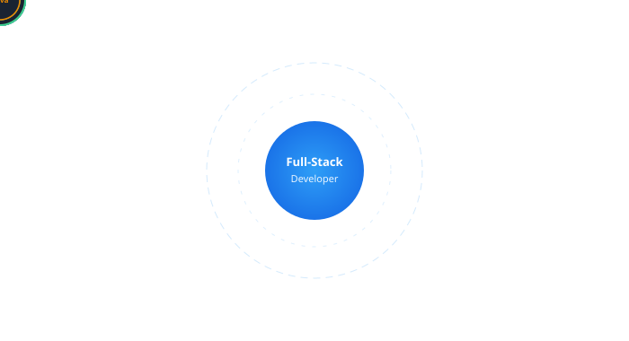

 

## Ciao, sono Alessandro

Sviluppo **applicazioni web e mobile** per aziende e professionisti che vogliono prodotti digitali **veloci, scalabili e curati nel dettaglio**. Dal design dell'interfaccia all'architettura backend, fino al deploy in produzione — un unico referente tecnico, risultati concreti.

## Cosa posso fare per te

## Stack tecnologico

### Frontend & UI

### Backend & Linguaggi

### Mobile

### Cloud, Database & Tools

## Competenze a colpo d'occhio

```mermaid
graph TB
    A[Alessandro Ambra]

    A --> B[Frontend]
    A --> C[Backend]
    A --> D[Mobile]
    A --> E[Cloud e DevOps]

    B --> B1[React e Next.js]
    B --> B2[Angular e Vue]
    B --> B3[HTML CSS SCSS]
    B --> B4[Tailwind CSS]
    B --> B5[TypeScript]

    C --> C1[Node.js APIs]
    C --> C2[Python Backend]
    C --> C3[Java e C#]
    C --> C4[SQL Databases]
    C --> C5[REST e GraphQL]

    D --> D1[React Native]
    D --> D2[Expo]
    D --> D3[Cross-Platform]
    D --> D4[Mobile UI UX]

    E --> E1[AWS Services]
    E --> E2[Vercel Deploy]
    E --> E3[Database Management]
    E --> E4[CI CD Pipeline]

    style A fill:#2E9EF7,stroke:#1a73e8,stroke-width:3px,color:#fff
    style B fill:#61DAFB,stroke:#20232A,stroke-width:2px,color:#000
    style C fill:#3776AB,stroke:#FFD43B,stroke-width:2px,color:#fff
    style D fill:#02569B,stroke:#13B9FD,stroke-width:2px,color:#fff
    style E fill:#FF9900,stroke:#232F3E,stroke-width:2px,color:#000
```

## Statistiche GitHub

## Parliamo del tuo progetto

  

<picture>
  <source media="(prefers-color-scheme: dark)" srcset="https://raw.githubusercontent.com/Alessandro-Ambra-dev/Alessandro-Ambra-dev/output/github-contribution-grid-snake-dark.svg">
  <source media="(prefers-color-scheme: light)" srcset="https://raw.githubusercontent.com/Alessandro-Ambra-dev/Alessandro-Ambra-dev/output/github-contribution-grid-snake.svg">
  
</picture>

⭐️ From [Alessandro-Ambra-dev](https://github.com/Alessandro-Ambra-dev)

