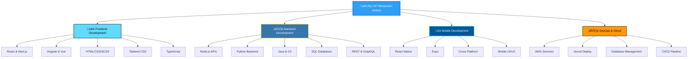

  
# üëã Ciao, sono Alessandro Ambra!

 
 
 
 

---

## üöÄ Chi Sono

Sono uno sviluppatore appassionato che ama creare applicazioni web e mobile moderne, scalabili e performanti. La mia missione è trasformare idee innovative in realtà digitali attraverso codice pulito e soluzioni eleganti.

---

## 💻 Linguaggi di Programmazione

---

## 🛠️ Framework & Librerie

---

## ☁️ Deploy & Hosting

---

## 🗄️ Database & Backend

---

## üìä Statistiche GitHub

  

---

## 🎯 Competenze Principali

```mermaid
graph TB
    A[👨‍💻 Alessandro Ambra]
    
    A --> B[üé® Frontend Development]
    A --> C[⚙️ Backend Development]
    A --> D[üì± Mobile Development]
    A --> E[☁️ DevOps & Cloud]
    
    B --> B1[React & Next.js]
    B --> B2[Angular & Vue]
    B --> B3[HTML/CSS/SCSS]
    B --> B4[Tailwind CSS]
    B --> B5[TypeScript]
    
    C --> C1[Node.js APIs]
    C --> C2[Python Backend]
    C --> C3[Java & C#]
    C --> C4[SQL Databases]
    C --> C5[REST & GraphQL]
    
    D --> D1[React Native]
    D --> D2[Expo]
    D --> D3[Cross-Platform]
    D --> D4[Mobile UI/UX]
    
    E --> E1[AWS Services]
    E --> E2[Vercel Deploy]
    E --> E3[Database Management]
    E --> E4[CI/CD Pipeline]
    
    style A fill:#2E9EF7,stroke:#1a73e8,stroke-width:3px,color:#fff
    style B fill:#61DAFB,stroke:#20232A,stroke-width:2px,color:#000
    style C fill:#3776AB,stroke:#FFD43B,stroke-width:2px,color:#fff
    style D fill:#02569B,stroke:#13B9FD,stroke-width:2px,color:#fff
    style E fill:#FF9900,stroke:#232F3E,stroke-width:2px,color:#000
```

---

## üåü Cosa Posso Fare per Te

- üé® **Sviluppo Frontend**: Creo interfacce moderne, responsive e user-friendly
- ⚙️ **Sviluppo Backend**: Architetture scalabili e API robuste
- üì± **App Mobile**: Applicazioni cross-platform con React Native ed Expo
- üöÄ **Deploy & DevOps**: Gestione completa del ciclo di vita delle applicazioni
- üíæ **Database Design**: Progettazione e ottimizzazione di database relazionali

---

## üì´ Contattami

---

  
### 💡 "Il codice è poesia, l'innovazione è arte"

⭐️ From [Alessandro-Ambra-dev](https://github.com/Alessandro-Ambra-dev)

